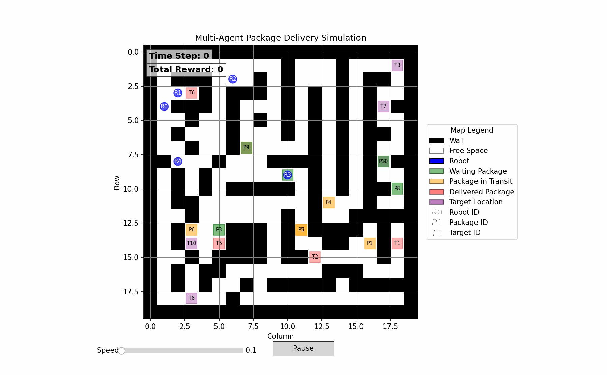

# Bài Tập Lớn Mô Phỏng Giao Hàng Đa Tác Tử (MARL)
Báo cáo có thể tìm thấy tại: https://drive.google.com/file/d/1xai7ZkXbP3oN0NY3XrKJeShyIcMTBXMZ/view?usp=sharing



## Tổng Quan

Dự án này triển khai môi trường Học Tăng cường Đa tác tử (MARL) cho mô phỏng giao hàng. Trong môi trường này, nhiều tác tử (robot) làm việc cùng nhau để thu thập và giao các gói hàng trong bản đồ dạng lưới đồng thời tránh các chướng ngại vật.

## Môi Trường

Mô phỏng diễn ra trên bản đồ lưới với các quy tắc sau:
- `0` đại diện cho ô trống mà các agent có thể di chuyển
- `1` đại diện cho chướng ngại vật/tường
- Các agent có thể di chuyển theo bốn hướng: Lên, Xuống, Trái, Phải
- Các gói hàng có vị trí bắt đầu, vị trí đích và thời hạn
- Các agent cần nhặt và giao gói hàng trước thời hạn

## Thành Viên Nhóm

### Phân Công Công Việc

| Tên | MSSV | Công Việc |
|-----|------|-----------|
| Trần Ánh Dương | 22028334 | Cài đặt 3 phiên bản thuật tự customize 0,1,2 và phát hiện các vấn đề khi cài đặt |
| Tăng Vĩnh Hà | 22028129 | Chuẩn bị code visualize để hỗ trợ phát hiện các vấn đề khi cài đặt, viết báo cáo, cài đặt phiên bản thuật tự customize 2 |
| Đỗ Minh Nhật | 22022537 | Chuẩn bị code visualize, cài đặt 2 phiên bản thuật toán A*, Conflict-based search và viết báo cáo. |

## Các Agent

Dự án bao gồm nhiều cài đặt agent khác nhau:

1. **Agent A* Cơ Bản (`astar_base.py`)**: Sử dụng thuật toán tìm đường A* để điều hướng đến vị trí nhận và giao gói hàng
2. **Lập Kế Hoạch Ưu Tiên A* (`astar_prioritized_planning.py`)**: Mở rộng A* với lập kế hoạch ưu tiên cho điều phối đa tác tử
3. **Agent CBS (`cbs_agent.py`)**: Triển khai thuật toán Tìm Kiếm Dựa Trên Xung Đột (CBS) cho bài toán tìm đường đa tác tử
4. **Agent Tham Lam (`greedyagent.py`, `greedyagent_optimal.py`)**: Các phương pháp tham lam đơn giản cho bài toán giao hàng
5. **Các Phiên Bản Agent Khác Nhau (`agentversion0.py`, `agentversion1.py`, `agentversion2.py`)**: Các cải tiến dần dần cho chiến lược agent

## Tìm Đường

Dự án bao gồm các tiện ích tìm đường:
- `find_path_map.py`: Tạo sẵn các đường đi giữa các vị trí trên bản đồ
- `plot_map.py`: Tiện ích để trực quan hóa bản đồ và đường đi của agent
- `utils.py`: Các hàm trợ giúp bao gồm các phương pháp tính khoảng cách (Manhattan, Euclidean, Đường chéo)

## Bắt Đầu

### Yêu Cầu

```bash
pip install -r requirements.txt
```

### Chạy Mô Phỏng

Cách sử dụng cơ bản:

```bash
python main.py
```

Với các tham số tùy chỉnh:

```bash
python main.py --num_agents 5 --n_packages 10 --max_steps 100 --seed 2025 --map map.txt
```

Các tham số:
- `--num_agents`: Số lượng robot giao hàng
- `--n_packages`: Số lượng gói hàng cần giao
- `--max_steps`: Số bước tối đa cho mỗi episode
- `--seed`: Seed ngẫu nhiên để có thể tái tạo kết quả
- `--max_time_steps`: Số bước thời gian tối đa cho môi trường
- `--map`: Tên file bản đồ (ví dụ: map.txt, map1.txt, v.v.)

## Bản Đồ

Dự án bao gồm một số file bản đồ:
- `map.txt`: Bản đồ cơ bản
- `map1.txt`, `map2.txt`, `map3.txt`, `map4.txt`, `map5.txt`: Các cấu hình bản đồ khác nhau

## Trực Quan Hóa

Mô phỏng bao gồm trực quan hóa thời gian thực (thông qua `visualize.py`) hiển thị:
- Bản đồ lưới với chướng ngại vật
- Vị trí và chuyển động của các agent
- Vị trí nhận và giao gói hàng
- Thông tin trạng thái bao gồm phần thưởng và số bước thời gian

## Lựa Chọn Agent

Để thay đổi cài đặt agent, hãy sửa dòng import trong `main.py`:

```python
# Bỏ comment cài đặt agent mong muốn
# from greedyagent import GreedyAgents as Agents
# from agentversion3 import AgentsVersion3 as Agents
# from cbs_agent import CBSAgent as Agents
from astar_base.py import AStarBase as Agents
# from astar_prioritized_planning import AgentsPrioritizedPlanning as Agents
```
